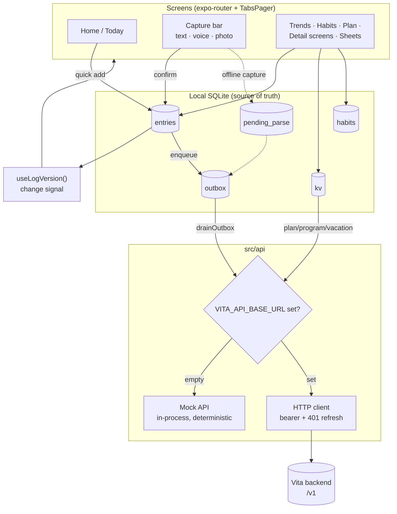
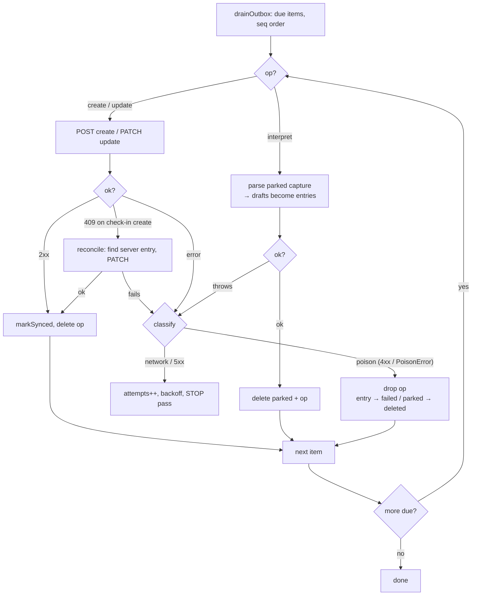
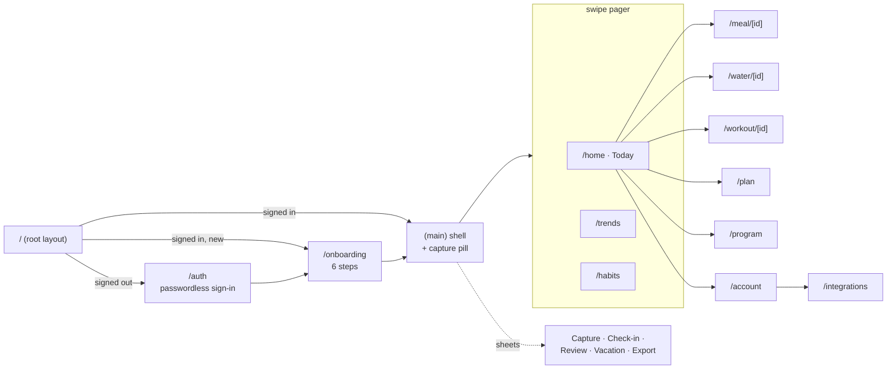

# Vita — mobile app

Vita is a personal health assistant: *a quiet log of meals, water & movement*. No
goals, no scores, no streaks, no advice — every number is an estimate, labeled as
one. Capture is the central interaction: an always-present bar takes text, voice or
a photo, parses it (backend), and shows a confirmation card before anything is
logged.

This is the Expo / React Native app. It is **offline-first**: local SQLite is the
source of truth for the log, and an outbox syncs to the backend in the background.

## Stack

- **Expo SDK 56** / React Native 0.85, **expo-router** (file-based navigation).
- **Reanimated 3 + react-native-gesture-handler** for motion (the prototype's
  fluidity: sheet drag-dismiss, tab pager, grow-in charts, morphing blobs).
- **react-native-svg** for the organic illustrations and the interactive muscle map.
- **expo-sqlite** (local log + outbox + kv), **expo-secure-store** (session tokens).
- **i18n-ready from day one** (`react-i18next`): English ships today; adding a
  language means adding one file under `src/i18n/locales/` — no code change.
- API types are **generated** from the OpenAPI contract (`npm run api:gen`); the app
  never hand-writes request/response shapes.

Why these: the CEO's criteria are UI fluidity, animation fidelity to the prototype,
and future-proofing. See `app/Doc/ADRs/` for the recorded decisions.

## Running it

The one-command launcher lives at the repo root: **`scripts/vita`** (put it on your
PATH or call it directly).

| Command | What it does |
|---|---|
| `vita up mock` | **App only, no backend, no Docker.** Deterministic in-process mock + seeded SQLite. Sign-in "just works". Best for walking the UI. |
| `vita up` | Full stack: Postgres + Kotlin backend on `:8080` + Expo pointed at the real backend over your LAN. |
| `vita logs` | Tail the backend log — the magic-link sign-in token is printed here. |
| `vita login` | Reprint the latest magic-link token as an `exp://` URL (Expo Go sign-in, see caveat below). |
| `vita down` | Stop Expo, backend and Postgres. |

Under the hood the only knob is **`VITA_API_BASE_URL`**:

- **unset / empty → mock mode** (`src/api/index.ts` `isMockApi`). No network, no
  backend. This is also what the Jest suite runs against.
- **set → real backend.** Must include the version prefix, e.g.
  `VITA_API_BASE_URL=http://10.0.2.2:8080/v1`. iOS simulator uses `localhost`;
  Android emulator uses `10.0.2.2`; a physical phone uses the Mac's LAN IP (same
  Wi-Fi).

Raw Expo (equivalent to what the launcher runs):

```bash
cd app/services/vita-app
npm install
npx expo start                                   # mock mode
VITA_API_BASE_URL=http://10.0.2.2:8080/v1 npx expo start   # real backend
```

### Expo Go SDK 56 constraints (important)

The app is designed to run in the **public-store Expo Go (SDK 56)** so the CEO can
test without a dev build. That pins two things:

- **Do not bump past SDK 56** until Expo ships a newer SDK to the public stores.
  `npx expo install --check` is the guard. (Newer SDKs need a dev client /
  TestFlight, which needs Apple/Play accounts — the **APP-007** blocker.)
- Some native capabilities can't run in Expo Go and are **stubbed behind
  interfaces** until the dev build lands (see *Load-bearing seams* below).
- **Magic-link sign-in caveat:** the backend emits a `vita://auth?token=…` link, but
  the custom `vita://` scheme only routes in a dev build. In Expo Go, open the token
  in the `exp://` scheme (`vita login` prints it) — or a `__DEV__`-only paste-token
  box on the sign-in screen accepts a pasted token. Mock mode has no caveat.

### Release builds

Release builds are made **manually by the CEO on his Mac** (no CI/CD in v1). The
reproducible flow: `npx expo export` produces the bundle; store builds go through EAS
once Apple/Play accounts exist (APP-007).

## Tests & checks

```bash
npx tsc --noEmit     # types (strict)
npx jest             # component + unit tests (168 tests / 34 suites)
npx expo export      # production bundle (Metro/Hermes) must succeed
npm run api:check    # fails if types.gen.ts drifts from the contract
```

E2E flows (Maestro YAML) live in `.maestro/` and are documented in
`app/Doc/e2e-maestro.md`; they are not part of the Jest gate (they need a device /
emulator).

## Project layout

```
app/                     expo-router screens (file = route)
  _layout.tsx            root: loads session, gates signed-out → /auth
  index.tsx              entry redirect
  auth.tsx               passwordless sign-in
  onboarding.tsx         6-step onboarding
  (main)/                authed shell — always-present capture pill
    _layout.tsx          mounts TabsPager + pill + all sheets; starts reconnect drain
    home / trends / habits         the three swipe tabs (render from src/tabs/*)
    meal|water|workout/[id].tsx    detail screens
    plan / program / account / integrations
src/
  ui/          design-system primitives + motion (Text, Card, Button, Bar, Toggle,
               Slider, BodyMap, WaveIllustration, SheetOverlay, PressScale, tokens…)
  capture/     the capture state machine (text/voice/photo → parse → confirm)
  db/          SQLite: entries, outbox, pending_parse, kv, habits, seed, sync
  api/         generated types, typed client (http) + deterministic mock
  nav/         TabsPager (swipe pager) + pager gesture ref
  trends/ habits/ plan/ energy/ vacation/ export/ review/   feature modules
  auth/        session (secure-store), magic link, OIDC stub
  i18n/        i18next setup + locales/en.json
```

## Architecture

Screens read from SQLite (never straight from the network). Writes land locally and
instantly, then the outbox drains to the backend in the background. A tiny
`useLogVersion()` signal (`src/db/notify.ts`) tells screens to re-read after any
local write.



## Offline / outbox sync

Every local entry's `id` is its own **Idempotency-Key**, so a retry after a lost
response replays (server returns the same row) instead of duplicating. The outbox
drains **in order** and stops at the first network/5xx failure so nothing behind a
stuck item jumps ahead.

Three outbox op types share the queue:

- **`create`** — POST a new entry.
- **`update`** — PATCH an already-synced entry (a check-in re-answer).
- **`interpret`** — a raw capture that couldn't reach `/parse` while offline was
  parked in `pending_parse`; on reconnect it is parsed and its drafts become entries
  (which enqueue their own `create` ops) in the same drain pass. Nothing is lost
  offline.

Offline captures are auto-added on reconnect **without** the confirm sheet the user
would normally see, so they are flagged **`needsReview`**. Home shows a "N offline
captures added — tap to review" banner (`ReviewSheet`) to give back the
confirm/adjust/discard affordance they skipped.

### Poison-pill taxonomy

The drain distinguishes *retry-forever* from *drop-and-continue*. Getting this wrong
either stalls the whole queue or silently loses data — so it is explicit:

| Condition | Classification | Action |
|---|---|---|
| Network error / 5xx | transient | back off (1s→2s→4s…, cap 5min), **stop** the pass (preserve order) |
| 400 / 409 / 422 on create | **poison** | drop the op; mark entry `failed` (Home shows "couldn't be saved") |
| 403 / 404 on an `update` op | **poison** | drop — a deleted/forbidden entry never comes back |
| `interpret` of a photo whose cached file is gone (`PoisonError`) | **poison** | drop the parked capture (would otherwise look like an endless network blip) |
| check-in `create` → 409 | reconcilable | the server already stored it → PATCH it to the new answer, don't drop |



The reconnect trigger (`src/db/reconnect.ts`) subscribes to NetInfo and drains on a
disconnected→connected transition; it is mounted once in `(main)/_layout.tsx`.

## Navigation / screen map

Three top-level tabs live in a **swipe pager** (`src/nav/TabsPager.tsx`) co-mounted
above the router Stack; detail/setup screens are ordinary pushed routes that slide in.



## Load-bearing seams (do not delete)

Some interfaces are stubbed on purpose because the real implementation needs a dev
build (APP-007) or isn't available in Expo Go. They are the swap-in points:

- **Voice recognition** — `src/capture/speech.ts` `SpeechRecognizer` + `setRecognizer`.
- **Native OIDC (Google/Apple)** — `src/auth/oidc.ts` `getOidcIdToken`.
- **Notifications** — `src/habits/notifier.ts` falls back to a no-op stub in Expo Go
  (the scheduling/permission APIs throw there); real local notifications arrive with
  the dev build.

## Gesture / motion invariants (device-verified, fragile)

The prototype fidelity work is worklet-heavy and was verified on-device. A few
non-obvious rules the code depends on:

- **Never `setState` mid-gesture.** Mounting a pager neighbor from a pan's `onBegin`
  recreates the gesture and resets its translation (the "swipe sometimes dead" bug).
  Neighbors pre-mount from a deferred effect (`src/nav/TabsPager.tsx`).
- **Mount tweens start from `onLayout`, not a bare `useEffect`** — effect-scheduled
  `withTiming` races view attachment on busy cold boots (`src/ui/useStartOnLayout.ts`).
  An animated `%`-height on an absolutely-positioned child never applies — use px.
- **Trends scrub vs pager:** the open card's scrub overlay `.blocksExternalGesture`
  the pager (published via `src/nav/pagerRef.ts`); a closed card has no Pan so the
  tab swipe wins.
- **PDF export:** the print cache isn't readable by the Android share provider →
  `printToFileAsync({ base64: true })` → write into the document dir → share
  (`src/export/pdf.ts`).
```
