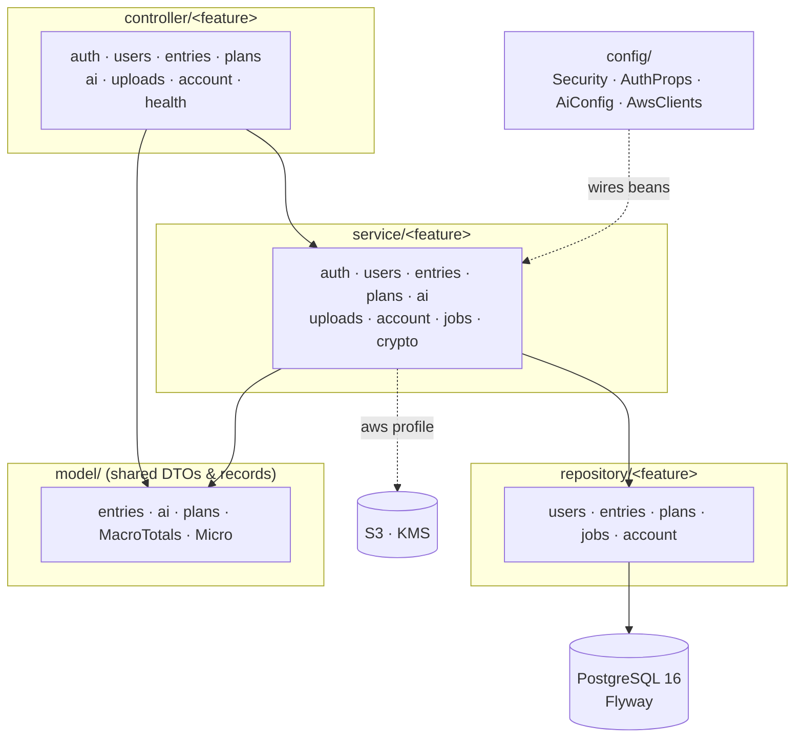
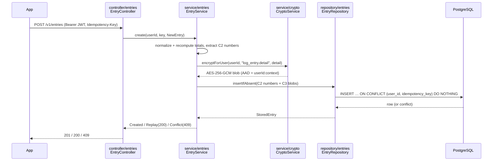
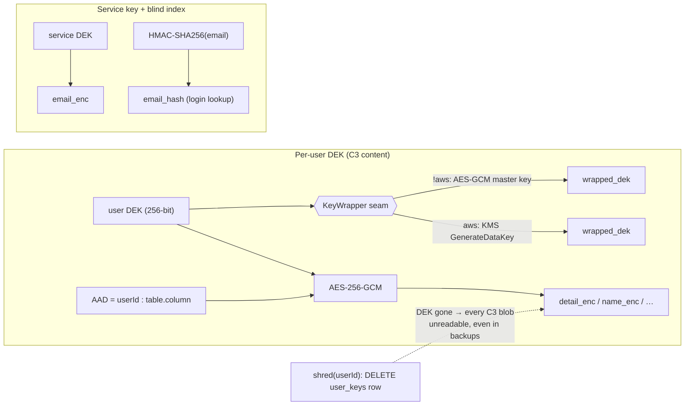

# vita-api

Vita's backend: Kotlin + Spring Boot 4, single Gradle module, **layer-first packages**
(`controller/` · `service/` · `repository/` · `model/` · `config/`, ADR-0014).
PostgreSQL 16 + Flyway (ADR-0002). Requires JDK 21 and Docker (for Postgres and Testcontainers).

A modular monolith (ADR-0001): no goals/scores/streaks/advice, estimates labelled as such,
C3 content encrypted per-user with crypto-shred deletion (ADR-0003). One `vita-api` service
behind API Gateway; AWS (S3/KMS) is reached only through swappable seams under the `aws`
Spring profile, so `./gradlew check` runs with no cloud.

## Package layout (ADR-0014)



`model/` breaks the only cross-layer cycle (services no longer import controller DTOs).
Crypto primitives + the KMS seam live under `service/crypto`; the load-bearing seams
`KeyWrapper`, `FileStore`, `Mailer` swap local↔AWS by profile.

## Request flow (write path)



## Crypto envelope (ADR-0003, ADR-0014)



- **Per-user DEK** encrypts each user's C3 content; the AAD binds every blob to
  `userId:table.column` (`AadContext`), so a ciphertext can't be replayed across users or
  columns. The wrapped DEK is stored KMS-wrapped (or master-key-wrapped locally).
- **Service DEK** encrypts account-boundary identity (email). **Blind index** = HMAC of the
  normalized email for login without decryption.
- **Crypto-shred**: account deletion drops the wrapped DEK; all that user's C3 data becomes
  permanently unreadable (ADR-0004).

## Run locally

```bash
cd backend/services/vita-api
docker compose up -d          # local Postgres 16 on :5432 (db/user/pass: vita/vita/vita)
./gradlew bootRun             # starts on :8080, Flyway migrations run at startup
curl localhost:8080/health    # {"status":"up"}
```

## Test and lint

```bash
./gradlew test     # unit + integration (Testcontainers spins its own Postgres — compose not needed)
./gradlew check    # test + ktlint + detekt
./gradlew ktlintFormat   # auto-fix formatting
```

## Migrations

Flyway scripts in `src/main/resources/db/migration/`, `V<NNN>__<name>.sql`, run at startup.
Rules (ADR-0002/0003):

- **Expand/contract only** — there is a single prod environment and no downtime window:
  add the new column/table first (expand), migrate readers/writers, drop the old one in a
  later migration (contract). Never rename/drop in the same release that stops writing.
- Every migration states the **data class (C1/C2/C3)** of each new column in a comment
  (ADR-0003); C3 columns are always encrypted `bytea`.

## Configuration

| Env var | Default | Purpose |
|---|---|---|
| `DB_URL` | `jdbc:postgresql://localhost:5432/vita` | JDBC URL |
| `DB_USERNAME` | `vita` | DB user |
| `DB_PASSWORD` | `vita` | DB password |
| `VITA_MASTER_KEY` | committed dev key | Wraps per-user DEKs (LocalKeyWrapper; prod = KMS CMK) |
| `VITA_SERVICE_DEK` | committed dev key | Encrypts account-boundary fields (email) |
| `VITA_HMAC_KEY` | committed dev key | Email blind index |
| `VITA_JWT_SECRET` | committed dev key | HS256 access-token signing |
| `VITA_MAGIC_LINK_BASE_URL` | `vita://auth` | Prefix of the magic-link URL |

The committed defaults protect throwaway local data only; production overrides all of
them from Secrets Manager / KMS (devops).

## Docker image (BE-004 / OPS-014)

Multi-stage `Dockerfile` producing a **linux/arm64** image for AWS Graviton
(devops cost-revision §1.5): JDK 21 build stage → slim `eclipse-temurin:21-jre`
runtime, non-root `vita` user, container-aware JVM (`-XX:MaxRAMPercentage=75.0`),
and a `HEALTHCHECK` on the DB-backed `/health` endpoint.

```bash
cd backend/services/vita-api
docker build --platform linux/arm64 -t vita-api .
docker image inspect vita-api --format '{{.Os}}/{{.Architecture}}'   # linux/arm64

# Run against local Postgres (compose network); needs the crypto/JWT env vars in prod.
docker compose up -d
docker run --rm -p 8080:8080 \
  -e DB_URL=jdbc:postgresql://host.docker.internal:5432/vita \
  vita-api
curl localhost:8080/health    # {"status":"up"}
```

The build stage is arch-neutral (JVM bytecode is portable), so it compiles on the
host arch with no QEMU emulation; only the runtime layer is pulled for arm64.
Deploy (ECR push, ECS task def) is owned by devops — this only makes the image
buildable so OPS-014 has something to push.

> Health check note: the container `HEALTHCHECK` hits `/health` (the existing
> DB-backed liveness endpoint), not `/actuator/health` — there is no actuator
> dependency and adding one just for a health probe isn't warranted. The ECS/ALB
> target-group health check should point at `/health` too.

## Auth in local dev

There is no SES yet: the magic-link email is faked by `LogMailer`, which prints the
link to the app log. Flow:

```bash
curl -X POST localhost:8080/v1/auth/magic-link -H 'Content-Type: application/json' \
  -d '{"email":"you@local.dev"}'                       # 202; link appears in the bootRun log
curl -X POST localhost:8080/v1/auth/magic-link/verify -H 'Content-Type: application/json' \
  -d '{"token":"<token from the logged link>"}'        # -> {accessToken, refreshToken, expiresIn}
```
